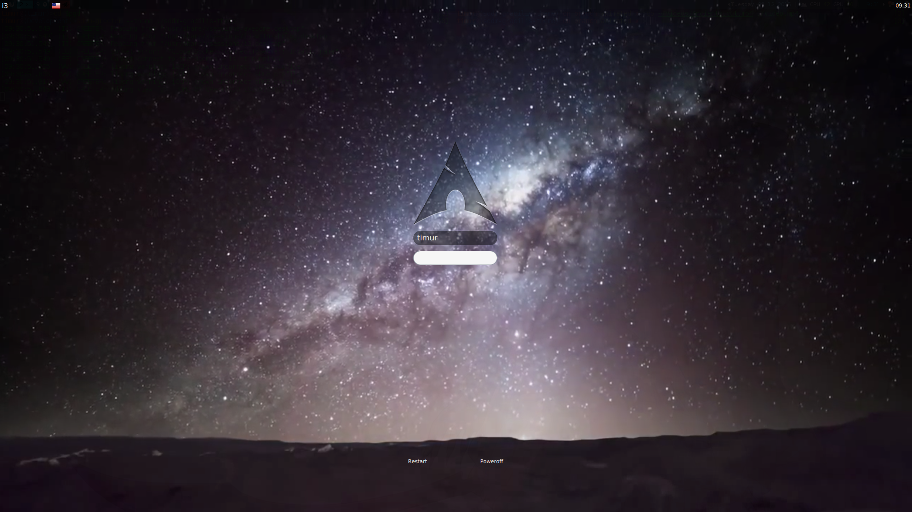

# sddm-gracilis-theme

Forked from [mikkeloscar/sddm-gracilis-theme](https://github.com/mikkeloscar/sddm-gracilis-theme) and edited to support videos for personal use. The video in the screenshot is from [here](https://www.youtube.com/watch?v=H5BAel-mHdY), cropped from `0:0:30` to `0:1:54` using `ffmpeg -i original.mp4 -ss 0:0:30.0 -c copy -t 00:01:54.0 video.mp4`. 

# usage
Place any video in the directory as `video.mp4`.

# screenshot

